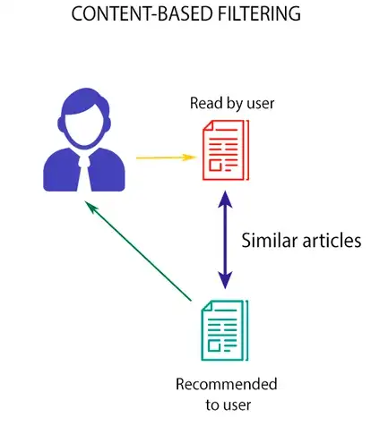

# UNIT-1-PROJECT

## Project Name :  Smart Diet Planner :

### Overview 
 The "Smart Diet Planner" is a Healthy Diet Plan Recommendation engine using a content-based approach to promote healthy eating habits through personalized food recommendations. Utilizing a content-based approach, this engine analyzes the nutritional content and ingredients of various foods to deliver tailored suggestions to users depending on his age, gender, weight, hight, activity level and health goal.
 
 

## What is a content-based recommendation?
A content-based recommendation is a type of recommendation system that uses the characteristics or content of an item to recommend similar items to users. It works by analyzing the content of items, such as text, images, or audio, and identifying patterns or features that are associated with certain items. These patterns or features are then used to compare items and recommend similar ones to users.

## Feature:
- Calculate his BMI
- Calculate his calories needs
- Generate recommendation meals for days
- Save the results to text file

